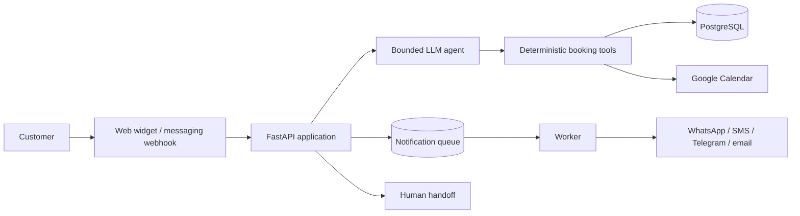

# Booking Agent Showcase

A production-derived, multi-tenant booking platform built with FastAPI and PostgreSQL. It combines a deterministic booking core with a bounded LLM agent, Google Calendar synchronization, customer notifications, staff workflows, and operational safeguards.

> **Portfolio note:** this repository is a sanitized snapshot of a real project that has been used in production. The business identity, tenant configuration, contact details, staff names, media, commercial material, credentials, and deployment-specific values have been removed or replaced with synthetic examples. This showcase is not the live production repository or deployment.

## Why this project exists

Service businesses often coordinate availability across a website, calendars, messaging channels, and human operators. A conversational model can make that flow easier for customers, but it must not be allowed to invent availability or bypass business rules.

This system uses the LLM only for conversation and intent interpretation. Availability, authorization, confirmation, idempotency, conflict prevention, and persistence are enforced by deterministic application code and the database.

## Engineering highlights

- **Multi-tenant isolation:** every booking, conversation, configuration record, and secret is scoped by `tenant_id`.
- **Bounded agent tools:** the model can call only explicit operations such as finding slots, creating or cancelling a booking, and handing the conversation to a person.
- **Database-backed conflict protection:** PostgreSQL constraints prevent overlapping active bookings, including services with different durations.
- **Signed slot offers:** an HMAC token binds a proposed slot to the tenant, service, staff member, and start time.
- **Idempotent operations:** repeated booking and notification requests resolve to the same logical operation instead of creating duplicates.
- **Reliable notifications:** a separate worker processes a durable queue with retries, delivery states, stale-task recovery, and SMS fallback.
- **Calendar safety:** a booking is acknowledged only after calendar synchronization succeeds; failures trigger rollback or human escalation.
- **Schema-controlled configuration:** one JSON schema drives validation, the administration form, and environment-variable guidance.
- **Migration discipline:** Alembic owns the PostgreSQL schema, and tests detect drift between migrations and SQLAlchemy models.
- **Operational controls:** health checks, backup and restore scripts, rate limits, PII masking, tenant-scoped secrets, and fail-closed integration states.

## Architecture



The critical trust boundary is between the agent and the tools. The model proposes structured actions; the tools revalidate policy, tenant scope, confirmation, slot signature, availability, and database constraints before changing state.

See [Architecture](docs/ARCHITECTURE.md), [Security and reliability](docs/SECURITY.md), and the [review guide](docs/REVIEW_GUIDE.md) for a focused walkthrough.

## Technology

- Python 3.12
- FastAPI and Uvicorn
- SQLAlchemy 2 and Alembic
- PostgreSQL 16; SQLite is supported for local tests
- OpenAI-compatible model providers behind a small adapter
- Google Calendar API
- Twilio, Telegram, SMTP, and webhook integrations
- Docker Compose
- Plain JavaScript administration and booking interfaces

## Run locally

### Fast local setup

```bash
python3.12 -m venv .venv
.venv/bin/pip install -r backend/requirements-dev.txt
DB_ALLOW_SQLITE=1 ADMIN_ALLOW_NO_TOKEN=1 CORS_ALLOW_ALL=1 \
  .venv/bin/uvicorn backend.app.main:app --reload
```

Then open:

- Demo widget: <http://localhost:8000/demo.html?tenant=demo-salon>
- Admin interface: <http://localhost:8000/admin.html>
- Health endpoint: <http://localhost:8000/health>

The default configuration uses local storage and console notifications. External credentials are not required to explore the main flow.

### Docker setup

```bash
cp .env.example .env
# Replace every required placeholder in .env before starting the stack.
docker compose up -d --build
```

The Compose stack runs PostgreSQL, migrations, the API, a notification worker, and scheduled backups.

## Tests

```bash
DB_ALLOW_SQLITE=1 PYTHONDONTWRITEBYTECODE=1 PYTHONPATH=. \
  python -m pytest backend/tests -q
```

Current sanitized snapshot: **452 tests passing** on Python 3.12. Continuous integration runs the same suite on every push and pull request.

The suite covers:

- slot calculation and signed-slot verification;
- booking races, interval overlap, cancellation, and rescheduling;
- tenant isolation and authorization;
- agent tool boundaries and human escalation;
- Google Calendar failure handling;
- notification idempotency, retries, fallback, and delivery callbacks;
- migrations and model/schema consistency;
- CORS, PII masking, secret handling, and rate limiting;
- multilingual web, WhatsApp, and Telegram flows.

## Suggested review path

If you have limited time, start with:

1. `backend/app/agent.py` — bounded agent orchestration.
2. `backend/app/tools.py` — deterministic booking commands and policy enforcement.
3. `backend/app/db.py` — persistence, tenant scope, idempotency, and constraints.
4. `backend/app/notify/service.py` — durable notification processing.
5. `backend/tests/test_tools.py` and `backend/tests/test_notifications.py` — behavioral evidence.

## Repository boundaries

This portfolio snapshot deliberately excludes:

- the real customer configuration and credentials;
- production databases, logs, backups, and analytics;
- customer or employee personal data;
- real business media and marketing material;
- infrastructure account identifiers and live deployment URLs;
- private commercial documentation.

The synthetic `demo-salon` tenant exists only to make the architecture and local flow reviewable. Production usage of the source project does not imply that this sanitized repository is itself deployed, publicly available, or representative of current business metrics.

## Known limitations

- The in-memory request limiter should be replaced by a shared store when the API is horizontally scaled.
- This snapshot demonstrates the application architecture; it does not include the production infrastructure account or observability workspace.
- Some UI and test fixtures intentionally contain Spanish and Russian text because multilingual behavior is part of the product.

## Ownership

I designed and implemented the system end to end: requirements discovery, architecture, backend and frontend development, LLM tool boundaries, integrations, reliability controls, tests, deployment workflow, and production support. AI-assisted development accelerated implementation and review, while architecture, security decisions, acceptance criteria, and final approval remained human-owned.
