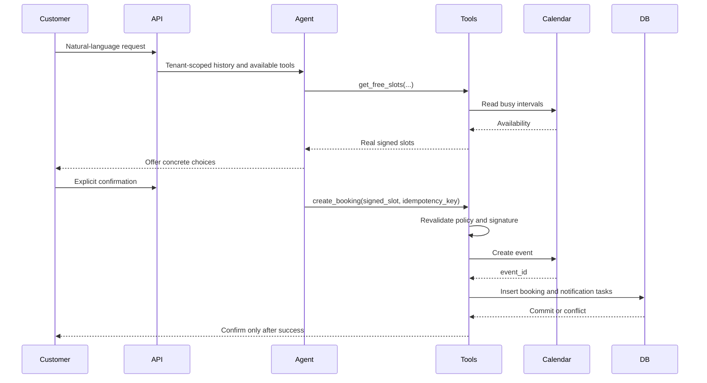

# Architecture

## Design objective

The platform must let customers book through a conversational interface without allowing the model to invent availability, cross tenant boundaries, or bypass business policy.

## Main components

1. **Channel adapters** normalize requests from the web widget, WhatsApp, and Telegram.
2. **Conversation state** persists messages and bounded step progress per tenant.
3. **Agent orchestration** asks the model for structured tool calls and limits the number of steps.
4. **Booking tools** validate tenant scope, service, staff member, confirmation, and signed slot data.
5. **Calendar service** reads availability and creates or removes external events.
6. **Database** stores bookings, clients, conversations, sessions, secrets, notification tasks, and audit-relevant state.
7. **Notification worker** leases durable tasks, calls providers, retries transient failures, and records delivery state.
8. **Human handoff** captures requests that are ambiguous, unsafe, unsupported, or blocked by an integration failure.

## Booking transaction

## Consistency decisions

- A displayed slot is advisory. Availability is checked again immediately before insertion.
- The database, not an in-process check, is the final authority on booking conflicts.
- External calendar failure does not produce a false confirmation.
- Notification jobs have stable names and unique constraints, making scheduling idempotent.
- A worker moves tasks through explicit states and returns abandoned leases to the queue.
- Tenant identity is part of slot signatures, database filters, secret lookup, and API routing.

## Why a modular monolith

The system is deployed as a small set of processes from one codebase: migration job, API, worker, database, and backup service. This keeps transactions and operational ownership simple while preserving clear module boundaries. Components can be extracted later if independent scaling or ownership justifies the additional distributed-systems cost.

